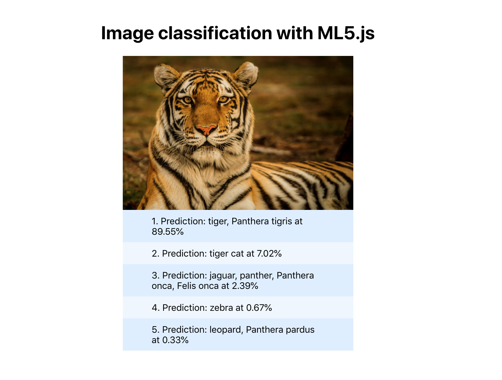

## In-Browser ML with React.js and ML5.js 🤖

https://medium.com/@julienrioux/in-browser-ml-with-react-js-and-ml5-js-f3eeb5149404

This is the repo for my article on Medium about how to implement im-browser Machine Learning using React.js and ml5.js!

While reading, you will create a simple image-regognition application:

